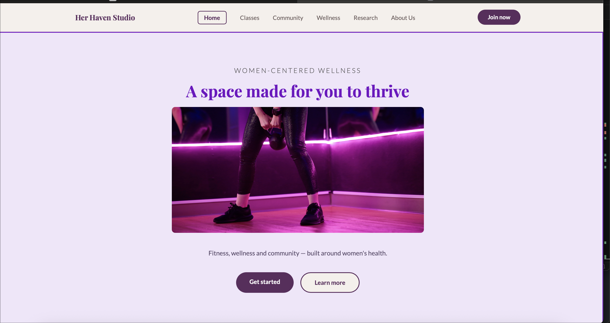
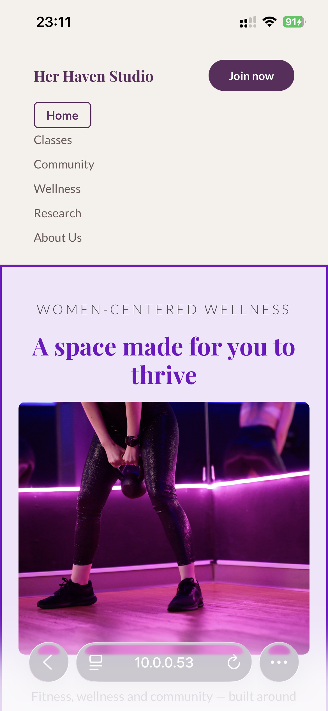

# herhavenstudio_website
Her Haven Studio Website by Ntokozo Mtsali-st10498443

1. Project Description
This project is a women-focused fitness and wellness website called Her Haven Studio. 
It provides information about classes, community, and wellness support.

2. The website aims to:
- Increase membership sign-ups and class bookings
- Promote fitness and wellness services
- Provide accessible women’s health education
- Build a supportive community

3.  Pages Included
- Home
- Classes
- Community
- Wellness
- Research
- Register

3. Features
- Navigation bar with links to all pages
- Hero section with an image
- Structured content using HTML only

4. How to Use
Open the index.html file in a web browser and navigate using the menu links.

5. Timeline and Milestones (7 Days)
- Day 1: Received proposal feedback and started creating wireframes
- Day 2: Design planning
- Day 3–4: Frontend development and styling
- Day 5: Functionality implementation
- Day 6: Content integration and testing
- Day 7: Final review. There was a hiccup with my repository. I deleted a folder locally 
- Day 8: final touches and submission.

6. Changelog
entry 1 - redid wireframes from mobile to window format
entry 2 - removed css code as per assessment instructions
entry 3 - added images
entry 4 -debugged code. updated image name to match names on code
entry 5 - made size adjustments to fit page and context
entry 6 - removed menu bar will add back once we can include js and filter pills

PART2
# Changelog — Her Haven Studio Website

## Part 2: CSS Styling and Responsive Design

### Overview
Part 2 involved creating an external CSS stylesheet to style all 10 HTML pages with a cohesive design system, implementing responsive design for mobile and tablet devices, and addressing feedback from Part 1.

---

## Part 1 Feedback Corrections

**Entry 1:** Removed lotus flower image from navigation logo
- The original logo included a lotus flower icon that created visual clutter
- Simplified to text-only branding using "Her Haven Studio" in Playfair Display serif font
- Improves navigation clarity and reduces cognitive load

**Entry 2:** Corrected image file paths in CSS
- Initial CSS used relative paths that failed to load images
- Updated all background-image paths to use `../images/` when CSS is in `/css/` subfolder
- All card images, hero images, and section backgrounds now load correctly across all pages

**Entry 3:** Fixed form button styling
- Updated button styling to match design system (plum background, rounded corners)
- Applied consistent hover states (darker plum on hover)
- Buttons now provide clear visual feedback for user interaction

**Entry 4:** Standardized color palette across all pages
- Implemented CSS variables (--plum, --beige, --blush, etc.) for consistency
- All pages now use the same colour scheme
- Reduces code duplication and simplifies future brand updates

**Entry 5:** Improved typography hierarchy
- Established clear font sizing scale using rem units
- Headings use Playfair Display (serif) for elegance
- Body text uses Lato (sans-serif) for readability
- Consistent line-height and spacing across all text elements

**Entry 6:** Enhanced spacing and padding consistency
- Applied uniform margin/padding to sections (40px desktop, 20px mobile)
- Cards and containers now have consistent internal spacing (24px-48px)
- Visual rhythm improved across all pages

**Entry 7:** Tested code across pages
- Validated CSS on all 10 HTML pages (index, classes, wellness, community, about, booking, contributor, login, register, research)
- Fixed page-specific styling issues
- Ensured consistent experience across entire site

---

## Part 2 New Additions

### CSS Architecture

**Entry 1:** Created external stylesheet (`css/style.css`)
- Single 2,500+ line CSS file managing all page styling
- Organized into logical sections with clear comments
- Linked to all 10 HTML pages via `<link rel="stylesheet" href="css/style.css">`

**Entry 2:** Implemented CSS variables (custom properties)
- Defined 9 brand colour variables in `:root`
- Enables consistent theming and easy colour updates
- Variables used throughout: `--plum`, `--beige`, `--blush`, `--white`, `--text`, `--text-mid`, `--border`, `--plum-dark`, `--plum-light`

**Entry 3:** Applied base reset and normalization
- Universal selector reset removes default margins/padding
- Box-sizing set to border-box for predictable layouts
- Consistent font family, colour, and line-height applied to body

### Navigation & Layout

**Entry 4:** Styled sticky navigation bar
- Beige background with subtle bottom border
- Flexbox layout with space-between justification
- Active page indicator with plum border and rounded corners
- Join Now button with hover state (darker plum)

**Entry 5:** Implemented responsive navigation
- Desktop: horizontal links with spacing
- Tablet (768px): maintains layout with reduced gap
- Mobile (640px): stacks vertically for touch accessibility

**Entry 6:** Created hero section styling
- Light purple background (#F0E6FA) with dark purple border
- Large serif heading (Playfair Display) in plum colour
- Two button styles: filled (plum) and outlined (beige with plum border)
- Responsive image with object-fit for consistent aspect ratio

### Grid & Flexbox Layouts

**Entry 7:** Built responsive grid systems
- Pillars section: 4-column grid (desktop) → 2-column (tablet) → 1-column (mobile)
- Classes cards: 3-column grid (desktop) → 2-column (tablet) → 1-column (mobile)
- Articles list: 2-column (desktop) → 1-column (tablet/mobile)
- All grids use CSS Gap property for consistent spacing

**Entry 8:** Implemented booking page layout
- Two-column grid for desktop (steps + form side-by-side)
- Single-column stack on mobile with beige background
- Removed card styling on mobile for seamless flow

**Entry 9:** Styled form layouts
- Form groups with label-input pairs
- Two-column form rows (desktop) → single column (mobile)
- Consistent input styling with focus states (plum border + subtle shadow)

### Component Styling

**Entry 10:** Designed card components
- Class cards: plum border, light purple background, hover lift effect
- Article cards: white background, subtle border, image + content layout
- Testimonial cards: clean white cards with author avatar and quote
- Event cards: horizontal layout with date badge and RSVP button

**Entry 11:** Created button system
- Base button styles with consistent padding/radius (40px border-radius)
- Multiple button variants: primary (plum fill), secondary (outline), tertiary (light)
- All buttons have hover states with background/colour transitions
- Mobile: buttons stack and expand to full width

**Entry 12:** Styled filter pills and tags
- Active/inactive states for class filter pills
- Colour-coded tags for categories (plum, pink, teal, amber, blue, green)
- Consistent sizing and spacing across all tags

### Page-Specific Styling

**Entry 13:** Login page styling
- Centered white card container on beige background
- Simplified header without sticky navigation
- Form inputs with focus states
- Google button variant (light plum with border)
- "Forgot password" and signup links

**Entry 14:** Register page styling
- Same centred card layout as login
- Checkbox for terms agreement
- Dropdown for health interest selection
- Consistent button styling

**Entry 15:** Booking page improvements
- Type pills (Classes, 1-on-1, Consultations) with active states
- Steps column: numbered circles (active=plum, inactive=grey)
- Form column: organized input fields
- Beige background throughout for clean aesthetic
- Fixed mobile layout to stack vertically with divider line

**Entry 16:** Wellness (Articles) section
- Featured article with white card and plum border
- Grid of article cards with images and metadata
- Article meta includes tags and read-time indicators
- Clean typography hierarchy

**Entry 17:** Community section
- Testimonial cards with author avatars (colour variants)
- Events list with horizontal cards
- Event dates in colour-coded badges
- Enquiry form with beige background

**Entry 18:** About page styling
- Tagline hero section with centred heading and image
- Mission/vision cards in two-column grid
- Values section with 4-column grid of cards
- Custom footer layout for about page

**Entry 19:** Research page components
- Focus areas grid (3 columns) with status badges
- Featured research articles with avatar cards
- Collaboration section with 4-column card grid
- Multiple button variants (webinar, volunteer, partner)

### Responsive Design Implementation

**Entry 20:** Mobile breakpoints (640px and below)
- Navigation: stacks vertically
- Hero: smaller font sizes, adjusted padding
- Grids: all convert to single column
- Form rows: convert to single column
- Buttons: full width on mobile
- Booking page: removes cards, stacks sections with divider

**Entry 21:** Tablet breakpoints (768px)
- Grids reduce to 2-column layout
- Navigation maintains horizontal with reduced gaps
- Booking layout converts to single column
- Footer reduces to 2-column layout

**Entry 22:** Desktop styles (1140px max-width)
- Multi-column grids with generous spacing
- Side-by-side layouts (booking, featured sections)
- Full navigation with all links visible
- Optimized reading line lengths

**Entry 23:** Responsive images
- All images use `object-fit: cover` for consistent aspect ratios
- Images scale with CSS width/height constraints
- No image distortion across devices

**Entry 24:** Responsive typography
- Base font sizes adapted for mobile (smaller)
- Headings use rem units for scalability
- Line-heights remain consistent (1.6-1.8) for readability
- Letter-spacing preserved for design elegance

### Bug Fixes & Refinements

**Entry 25:** Fixed booking form mobile layout
- Removed max-width constraints on mobile
- Beige background fills entire screen (no white cards)
- Form and steps sections stack vertically
- Proper padding for readability on narrow screens

**Entry 26:** Fixed login/register card sizing
- Mobile: full-width cards with reduced padding
- Desktop: max-width 450px with larger padding
- White background maintained for form fields
- Beige page background for contrast

**Entry 27:** Corrected form input styling
- All inputs have consistent 12px padding
- Border colour changes on focus (plum)
- Shadow on focus for accessibility
- Placeholder text styled appropriately

**Entry 28:** Enhanced hover states
- Cards lift on hover (translateY -4px)
- Links underline on hover for clarity
- Buttons change colour on hover
- Smooth transitions (0.2s) for all interactions

**Entry 29:** Improved footer consistency
- Dark plum background across all pages
- 4-column layout (desktop) → 1-column (mobile)
- Consistent link styling and hover states
- Social icons and copyright text aligned

**Entry 30:** Added visual feedback
- Focus states on all inputs and buttons
- Hover states on all interactive elements
- Active states on navigation links
- Loading and transition animations (0.2s)

---

## Testing & Validation

**Desktop Testing:** Verified styling on Mac using VS Code Live Server at full width (1140px)

**Tablet Testing:** Used browser DevTools to test at 768px breakpoint (iPad dimensions)

**Mobile Testing:** Tested on iPhone 13 at 375px width via local IP address (192.168.8.5:5500)
- Homepage: responsive hero, stacked sections
- Booking page: vertical layout, beige background
- Register/Login: full-width white cards, beige background
- All pages: navigation stacks, grids convert to single column

**Browser Compatibility:** CSS tested on Safari (iPhone, Mac) with standard properties (no vendor prefixes needed for modern browsers)

---

## Summary

**Part 2 Achievements:**
- ✅ Created 2,500+ line external CSS stylesheet
- ✅ Styled all 10 HTML pages consistently
- ✅ Implemented responsive design (desktop, tablet, mobile)
- ✅ Applied CSS variables for maintainable theming
- ✅ Created reusable component styles (buttons, cards, forms)
- ✅ Fixed Part 1 feedback issues
- ✅ Tested across multiple devices and screen sizes
- ✅ Documented all changes in this changelog

**Key Design Decisions:**
- Plum (#5C2D5E) as primary brand colour for accessibility and elegance
- Beige (#F5F0EB) as secondary background for warmth and contrast
- Serif font (Playfair Display) for headings to convey premium brand
- Sans-serif font (Lato) for body text for web readability
- Mobile-first approach with progressive enhancement to larger screens
- Consistent spacing using 8px base unit (multiples: 8, 12, 16, 20, 24, 32, 40, 48)

### Responsive Design Screenshots

### Desktop View 

### Mobile View - iPhone 13 

## Part 3 Changelog

## Part 2 Feedback Corrections

- **Entry 1**: Enhanced default CSS styles - Added comprehensive default styling for typography, spacing, and element resets to improve visual consistency.

- **Entry 2**: Refined typography across all pages - Updated font-size, line-height, and letter-spacing for better readability and hierarchy on all screen sizes.

- **Entry 3**: Improved responsive design adjustments - Enhanced media queries for tablet (768px) and mobile (480px) with proper layout and typography scaling.

- **Entry 4**: Restructured changelog with detailed entries - Replaced vague entries with specific documentation of changes, reasoning, affected files, and results for complete development transparency.

- **Entry 5**: Updated README documentation - Reorganized README with clearer project structure and more detailed descriptions of CSS implementations.

### Form Validation Implementation
- **Entry 1**: Implemented comprehensive form validation across all pages including: Register.html validates firstname/lastname (no numbers), email format, password strength (min 8 chars), password confirmation, and terms agreement. Booking.html validates programme selection, future dates only (rejects past dates), time slots, fullname (no numbers), and email format. Community enquiry validates name (no numbers), email, and message length (min 10 chars). Login form validates email format and password minimum length.

- **Entry 2**: Added contributor form validation - Validates firstname/lastname (no numbers), email format, role/profession requirement, institution/organization requirement, area of specialization, and message content (minimum 20 characters). Provides clear error alerts for each validation rule.

### Interactive Features
- **Entry 3**: Implemented image slideshow on index.html - Created auto-rotating carousel with 5-second intervals and manual navigation buttons (previous/next). Applied CSS mask-image gradient for soft edge blending into background. Images transition smoothly with proper sizing and responsiveness.

- **Entry 4**: Created FAQ accordion on community.html - Added 5 collapsible FAQ items with click-to-expand functionality. Only one accordion item open at a time for better UX. Smooth toggle animations with clear visual feedback.

- **Entry 5**: Added cloudy background to hero section - Integrated Pexels cloud image as hero background with CSS parallax effect (background-attachment: fixed). Fixed relative path (../images/clouds-background.jpg) to correctly load from images folder. Applied proper fallback background color.

- **Entry 6**: Embedded Google Maps on about.html - Added interactive Google Maps embed showing Her Haven Studio's actual location (Amdec House, 1 Melrose Square, Melrose Arch, Johannesburg). Map displays with proper sizing, border radius, and shadow effects. Fully responsive on mobile and desktop.

### Code Documentation & Quality
- **Entry 7**: Added comprehensive JavaScript comments - Each validation function includes detailed comment blocks explaining purpose, parameters, and validation logic. Form event listeners clearly document which pages they target and which functions they trigger.

- **Entry 8**: Optimized form button implementation - Added onclick="return false;" to all form submission buttons to prevent default navigation. Event listeners attached via DOMContentLoaded to ensure all form elements are loaded before attaching handlers.

### Deployment & Testing
- **Entry 9**: Tested all form validations - Verified register, booking, login, community enquiry, and contributor forms reject invalid inputs and show appropriate error messages. Confirmed past date rejection on booking form works correctly.

- **Entry 10**: Tested interactive features - Confirmed slideshow auto-advances every 5 seconds and manual buttons navigate correctly. Verified accordion expands/collapses smoothly. Tested Google Maps loads and displays location properly.

## HERO SECTION CHANGES
- **Entry 11**: Added cloudy background to hero section - Integrated cloud background image as hero section background using CSS. Fixed relative path (../images/clouds-background.jpg) to correctly load from images folder. Applied background-size: cover, background-position: center, and background-attachment: fixed for responsive parallax effect. Added fallback background-color for page loading.

### Search Engine Optimization (SEO)
- **Entry 12**: Added meta descriptions to all 10 pages - Implemented descriptive meta descriptions for index.html, classes.html, community.html, wellness.html, research.html, about.html, register.html, login.html, booking.html, and contributor.html. Each description is optimized for search engines and accurately describes page content.

- **Entry 13**: Implemented title tags across all pages - Added comprehensive, keyword-rich title tags to all 10 HTML pages. Each title includes the brand name "Her Haven Studio" plus relevant keywords (e.g., "Classes | Her Haven Studio - Yoga, Pilates, Strength Training" for classes.html).

- **Entry 14**: Added meta keywords for search optimization - Implemented relevant keyword meta tags on all pages targeting women's fitness, wellness, classes, community, health education, and Johannesburg location. Keywords are specific to each page's content.

### Deployment Preparation
- **Entry 11**: Ready for GitHub Pages deployment - All features tested and working. JavaScript properly linked across all pages. CSS styling applied consistently. Repository updated with all changes and descriptive commit messages.

7. References
(a) Florida Endocrinology and Diabetes Center (2026) How (and why) to cycle your exercise with your menstrual cycle. Available at: View article (Accessed: 21 April 2026).
(b) Mozilla Developer Network (2026). HTML: HyperText Markup Language. [online] Available at: https://developer.mozilla.org/en-US/docs/Web/HTML [Accessed 20 April 2026].
(c) Pexels (2025). Free stock photos. [online] Available at: https://www.pexels.com [Accessed 20 April 2026].
(d) Unsplash (2025). Free high-resolution photos. [online] Available at: https://unsplash.com [Accessed 20 April 2026].
(e) Visual Studio Code (2025). Visual Studio Code — Code Editing. [online] Available at: https://code.visualstudio.com [Accessed 20 April 2026].
(f)Whimsical (2025). Whimsical — The Visual Workspace. [online] Available at: https://whimsical.com [Accessed 20 April 2026].
(g) W3Schools (2025). CSS Tutorial. [online] Available at: https://www.w3schools.com/CSS [Accessed 20 May 2026].
OpenAI. (2026) AI-generated image of a diverse group of women after a fitness workout. Generated using ChatGPT image generation, 22 June.
OpenAI. (2026) AI-generated image of a women's Zumba/cardio fitness class with purple lighting. Generated using ChatGPT image generation, 22 June.
